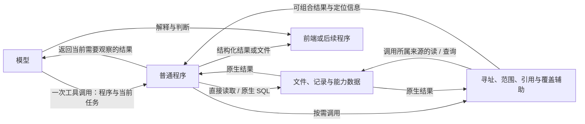

# 数据访问设计

本文件记录实验后保留的设计。它是研究结论，尚未修改 Repa 的应用协议。实测依据见[研究报告](../results/2026-10-01/report.md)。

## 数据与程序的关系

数据继续保存在原生文件和能力自己的结构化存储中。Agent 通过普通程序读取、筛选和组合数据；需要模型判断的结果再进入模型上下文。程序中间值沿用变量、文件或已有资源引用。

提供器暴露原生查询及确有重复使用价值的组合操作。实验中的统一接口减少了若干任务的定位和拼接往返；单纯 SQL 选择没有表现出同样收益。按能力提供这些操作，不把统一接口设为所有读取的必经入口。

图中读取、查询与模型观察已完成实测；精确结果直接交付的建议另以观察结果的确定性重放核对。模型循环仍由 Codex 或 Pi 一类既有运行时承担；辅助层不拥有文档正文或业务数据库。

## 保留的公共约定

| 约定 | 行为 | 责任归属 |
| --- | --- | --- |
| 对象身份 | 身份不等同于文件路径、显示标题或当前处理器；不同查询找到同一对象时保留同一引用 | 内容系统或业务数据 owner |
| 范围 | 显式对象集合先于查询截断；空集合为空，不自动沿链接扩张；结果集合直接成为下一次操作的输入 | 接受范围的查询能力 |
| 覆盖 | 已判断无匹配、尚未覆盖、读取失败和返回截断分别表达 | 来源提供器说明局部状态，组合调用保留状态 |
| 定位与修订 | 引用出现位置绑定实际读取的版本；多个出现分别保留；重新使用旧位置时核对版本 | 解释原生格式的来源能力 |
| 结果交付 | 精确结果来自程序值或文件，解释不改写这份数据 | 执行能力与结果消费者 |

公共约定不要求所有对象预先进入一张全局表。已知对象通过其拥有者解析；新返回的记录引用也应由该数据能力解释。原型的 inventory.json 是有限实验空间的对象目录，不能据此要求插件提前登记所有数据库行。

“来源”必须分别说明数据属于谁、哪个实现负责访问，以及一次查询涵盖什么范围。替换解析实现不改变对象身份；同一对象的多个表示也不产生多个业务身份。

## 覆盖情况必须绑定查询域

查询结果完整，仅表示声明的范围内完成了约定操作。实验中的 `within=None` 查询 inventory.json 的对象，不表示查询了磁盘所有文件或 SQLite 所有表。`complete` 表示这些对象的处理覆盖；`truncated` 独立表示返回项是否被截断。

进入多能力的产品实现时，查询域先由所请求的数据范围决定，再寻找适用提供器。不能以“有哪些已注册查询处理器”反过来定义全部数据并宣称完整。已知数据来源未实现相关操作时，保留未覆盖状态及原生访问入口。

例如声明要查询文档与练习记录中的全部引用，只有文档提供器成功，不足以回答没有练习记录引用它。调用方继续查询原生记录，或把该部分保留为未决；一个成功的空列表不能替代这项判断。

## 引用解释与原生访问

显式链接、结构化关系字段和仅出现地址的文字分别处理。CommonMark reference-style 链接的每次使用计入，代码样例不计入；Markdown 内嵌 HTML 和原生相对路径也属于来源需要解释的内容。

原生相对地址由来源解析后映射到对象身份。稳定身份不会自动改写已有相对链接；移动文件若改变相对地址含义，需要原内容操作维护这些地址。修改查询索引不能修复正文中的链接。

不要求所有引用复制进中央持久索引。提供器按需扫描、调用既有索引或复用解析库；索引位置是实现选择。返回的引用保持出现位置、目标位置、原关系类型与修订，不依据一条链接推测支持、反驳或前置关系。

## 发现与组合

来源说明保留记录含义、字段单位、时间规则、关联键和查询入口。实验中这些说明通过普通文件取得；现阶段没有依据要求另建目录搜索服务。接入产品时优先使用已有能力说明与发现入口。

已经存在的范围列表、结构化查询结果和输入附件应能被程序直接取得。不要要求模型将它们逐项重新生成进下一次调用。实验的 `reference-scope.json` 就是一个普通输入文件，不需要为此创建新的结果持久化系统。

精确清单和计算结果由程序作为结构化结果或普通文件交付，前端读取同一结果。模型负责解释和下一步判断，不重新生成一份具有权威性的副本。较小模型的轨迹中出现过程序结果正确、最终 JSON 增加错误位置或非匹配对象的情况；仅优化查询入口并不能保护这次重新转录。

跨来源组合使用普通代码；SQLite 等来源保留原生查询语言。业务算法、字段含义和迁移继续属于相应能力。跨来源相关性分数的统一排名没有在本实验中实现，不直接混排不同来源的分数。

## 与 Repa 的接入边界

Repa 已有 ContentRef、修订和内容保存入口应继续承担文档身份与写入。查询结果携带来源引用和修订，后续修改回到已有内容或业务操作。读取辅助不建立第二套写回、事务、历史和撤回机制。

材料检索与内容整理任务适合先消费范围、引用定位及覆盖约定。复习等能力继续提供自己的数据说明、查询与算法；只有跨能力确有共同消费者的部分才共享实现。研究原型的 Space 类不作为一个必须整体移植的产品模块。

当前建议保留：原生访问、可编程组合、稳定引用、范围先于截断、完整性与未覆盖状态、绑定修订的位置、直接交付程序结果。当前不采用：新存储引擎、统一业务 schema、通用查询语言、强制中央关系库、自动把查询结果注入学习语境。
