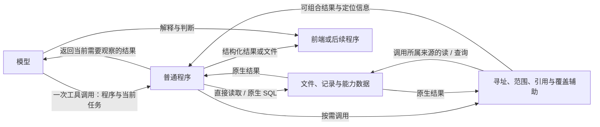

# 数据访问设计

本文件记录 Agent 数据组织与访问的研究方案。依据包括[查询与组合实验](../results/2026-10-01/report.md)和[资料发现、连续工作与产物实验](../results/2026-10-01-observations/report.md)。方案通过原生来源、可执行工作表示、来源观察和精确产物交付组合实现，尚未修改 Repa 的应用协议。

## 研究范围

目标包含从异构原始材料发现信息、按任务形成表示、执行组合任务、维护表示与来源的关系，以及在任务和材料变化后继续使用它。现有查询接口只覆盖其中一部分。

研究检验了未给出字段映射时的来源发现、手册到计算程序的解释、任务和来源变化、文件与会话接续、原生压缩、分片与历史副本，以及程序生成的 CSV 和交互网页。当前实现用有限来源集合进行这些验证；布局实验扩大文件数量，保留相同记录数量。

实验基线保留正常编程能力，并允许保存脚本和产物供后续任务使用。准备、发现、材料化、更新和消费的成本一起计算，避免把预处理免费提供给一种方案。最终交付按完整任务与连续使用判断，不能由局部查询正确或某项 token 下降替代。

## 组织单位与责任

组织单位由内容含义和操作决定。一个费用表可以由一个 JSON 文件或数百个分片承载；一个当天查询可能依赖整月的聚合；同一分析结果可以同时供 CSV 消费者和网页使用。目录、文件、查询范围与计算依赖分别表达。

| 对象或过程 | 需要保留的信息 | 负责者 |
| --- | --- | --- |
| 来源 | 原生数据、内容身份或来源定位、版本、读取与查询入口 | 内容或业务数据 owner |
| 来源说明 | 字段含义、单位、空值含义、时间规则、逻辑集合边界、必要关联 | 定义这些含义的来源或能力 |
| 工作表示 | 针对任务形成的程序、查询、表、笔记及其依据 | 创建和继续维护这项工作的 Agent、用户或能力 |
| 模型观察 | 本次选取的原文、结构与变化；对应来源、修订和覆盖范围 | 输入准备与访问能力，接入现有模型运行时 |
| 交付产物 | 程序实际产生的值、文件或资源，以及所用输入与结果版本 | 执行结果与内容持久化 owner |

这些是工作中的角色，不要求为每一行记录登记全局身份。上一步的产物可成为下一步的来源，工作表示也能保存为长期文档。现成原生格式、程序和查询语言承载内容；共享约定负责它们之间的寻址、含义和状态。

类型推断只说明结构。费用规则中空列表表示不限制，是该来源的业务约定；查询参数中的空范围仍表示空集合。不能从一个场景推出通用的空值含义。声明、机械提取和模型推断需要保留各自依据。

## 数据与程序的关系

数据继续保存在原生文件和能力自己的结构化存储中。Agent 通过普通程序读取、筛选和组合数据；需要模型判断的结果再进入模型上下文。程序中间值沿用变量、文件或已有资源引用。

提供器暴露原生查询及确有重复使用价值的组合操作。实验中的统一接口减少了若干任务的定位和拼接往返；原始资料任务中新增的 Catalog API 则没有被模型采用。后续通过原有输入和文件工具提供观察，避免先要求模型学习另一组访问命令。普通程序保留筛选、循环、连接与计算能力。



图中的精确交付已用于后续实测：模型生成结果文件，宿主读取同一文件评分，CSV 与网页消费同一计算结果。模型循环仍由 Codex 或 Pi 一类既有运行时承担；辅助层不拥有文档正文或业务数据库。

## 保留的公共约定

| 约定 | 行为 | 责任归属 |
| --- | --- | --- |
| 对象身份 | 身份不等同于文件路径、显示标题或当前处理器；不同查询找到同一对象时保留同一引用 | 内容系统或业务数据 owner |
| 范围 | 显式对象集合先于查询截断；空集合为空，不自动沿链接扩张；结果集合直接成为下一次操作的输入 | 接受范围的查询能力 |
| 覆盖 | 已判断无匹配、尚未覆盖、读取失败和返回截断分别表达 | 来源提供器说明局部状态，组合调用保留状态 |
| 定位与修订 | 引用出现位置绑定实际读取的版本；多个出现分别保留；重新使用旧位置时核对版本 | 解释原生格式的来源能力 |
| 结果交付 | 精确结果来自程序值或文件，解释不改写这份数据 | 执行能力与结果消费者 |

公共约定不要求所有对象预先进入一张全局表。已知对象通过其拥有者解析；新返回的记录引用也应由该数据能力解释。原型的 inventory.json 是有限实验空间的对象目录，不能据此要求插件提前登记所有数据库行。

“来源”必须分别说明数据属于谁、哪个实现负责访问，以及一次查询涵盖什么范围。替换解析实现不改变对象身份；同一对象的多个表示也不产生多个业务身份。

## 覆盖情况必须绑定查询域

查询结果完整，仅表示声明的范围内完成了约定操作。实验中的 `within=None` 查询 inventory.json 的对象，不表示查询了磁盘所有文件或 SQLite 所有表。`complete` 表示这些对象的处理覆盖；`truncated` 独立表示返回项是否被截断。

进入多能力的产品实现时，查询域先由所请求的数据范围决定，再寻找适用提供器。不能以“有哪些已注册查询处理器”反过来定义全部数据并宣称完整。已知数据来源未实现相关操作时，保留未覆盖状态及原生访问入口。

例如声明要查询文档与练习记录中的全部引用，只有文档提供器成功，不足以回答没有练习记录引用它。调用方继续查询原生记录，或把该部分保留为未决；一个成功的空列表不能替代这项判断。

## 引用解释与原生访问

显式链接、结构化关系字段和仅出现地址的文字分别处理。CommonMark reference-style 链接的每次使用计入，代码样例不计入；Markdown 内嵌 HTML 和原生相对路径也属于来源需要解释的内容。

原生相对地址由来源解析后映射到对象身份。稳定身份不会自动改写已有相对链接；移动文件若改变相对地址含义，需要原内容操作维护这些地址。修改查询索引不能修复正文中的链接。

不要求所有引用复制进中央持久索引。提供器按需扫描、调用既有索引或复用解析库；索引位置是实现选择。返回的引用保持出现位置、目标位置、原关系类型与修订，不依据一条链接推测支持、反驳或前置关系。

## 发现与组合

来源说明保留记录含义、字段单位、时间规则、关联键和查询入口，并与其解释的对象或字段关联。将相同规则从手册末尾移到字段说明旁后，local_contract 四条序列的首次解释全部正确；持续会话中仍有沿用旧公式的情况。清楚的来源说明与变化后的接续承担不同作用。

来源已有结构与说明时直接提供。原始材料缺少入口时，按需提取目录、标题段落、schema 与样本，保留原文和原生访问。词法检索只是候选选择，不能把若干命中段落宣称为完整业务定义。中文检索使用现成分词；SQL、CSV、JSON 等读取继续复用现有库。数据与元数据包装可借鉴 Data Package、CSVW 等[已有格式](related-systems.md)，不要求所有来源改成同一种格式。

已经存在的范围列表、结构化查询结果和输入附件应能被程序直接取得。不要要求模型将它们逐项重新生成进下一次调用。实验的 `reference-scope.json` 就是一个普通输入文件，不需要为此创建新的结果持久化系统。

精确清单和计算结果由程序作为结构化结果或普通文件交付，前端读取同一结果。模型负责解释和下一步判断，不重新生成一份具有权威性的副本。较小模型的轨迹中出现过程序结果正确、最终 JSON 增加错误位置或非匹配对象的情况；仅优化查询入口并不能保护这次重新转录。

跨来源组合使用普通代码；SQLite 等来源保留原生查询语言。业务算法、字段含义和迁移继续属于相应能力。跨来源相关性分数的统一排名没有在本实验中实现，不直接混排不同来源的分数。

## 接续与变化

普通程序、查询、表和笔记本身已经是工作表示。此前连续实验检验了它们能否接续，以及来源观察的作用；[跨任务组织实验](work-organization-experiments.md)进一步区分自然组织、文档说明和同内容的程序可操作结构，并计入初始形成、整理与再次交接。该项目交接中普通工件完成了后续组合，可查询记录未取得稳定的成本优势，见[结果](../results/2026-10-02-handoff/report.md)。用途、依据和适用条件按需要随工件保存，不把统一登记作为复用前提。

工作表示保存已经形成的解释；它也可能保存错误解释。复用时分别处理任务参数、新数据和定义变化。程序读取当前交易数据就能重算月总量；若程序把手册中的费率单位编译成常量，更新数据本身不能修正这项常量。

来源变化通过已有修订、事件与可确认差异告知。模型据此决定重算、修改程序、补读或继续沿用；不因每次字节变化强制重建全部表示。没有已知旧正文或差异过长时返回变化提示与读取入口。查询结果范围也不代替依赖范围：1 月 10 日费用可以依赖 1 月 20 日交易形成的月总量，具体关系由计算的含义决定。

新会话从保留的工作文件接续。压缩与分支恢复沿用模型运行时；输入准备依据当前有效上下文决定是否重新提供来源观察，不把外部保存的“曾经提供过”标记等同于模型现在仍持有。已有背景不在同一运行的每个工具步骤中重复注入。

本原型的差异调查扫描指定实验语料。接入 Repa 时消费现有内容修订、实际读取结果与变化事件；普通文件差异的可用基准沿用已有约定，不据此增加全空间扫描或全局阅读状态库。来源不可用、格式未处理与结果截断分别保留。

## 可复用实现

`catalog.py` 使用 Markdown 解析、SQLite FTS、jieba 与 DuckDB 提取结构并检索原文；`observations.py` 返回来源快照、变化与候选观察。这些模块独立于模型运行时。实验中的 `runner.py` 接入 Codex 原生工具循环、使用量、接续与压缩，不实现另一套 Agent loop。

当前观察模块只保存可重建的 profile 与文本索引。未被模型采用的实验 SQL 包装已经移除；查询和持久视图使用原生 DuckDB 等工具，Agent 创建的工作表示单独保存。旧接口仅随原批次的冻结实现保留。派生缓存损坏时从来源重建，不把程序、业务数据或用户笔记放入会被重建的缓存。

组成一次观察时，调用方决定来源范围和是否提供自动观察。原文与变化是可组合输入；本次实测不支持把它们设为所有任务必经路径。它们降低了若干序列的 token 使用量，Astra 的复合工作中也出现未缓存输入增加。普通代码、清楚的来源说明和保存完好的产物仍是基线能力。

```python
from agent_data_lab.observations import discover, source_snapshot, source_changes

# root 是明确选定的来源集合；cache 位于该集合之外。
current = source_snapshot(root)
initial_observation = discover(root, cache, question)
changed_observation = source_changes(previous, current)  # 有可用旧快照时
```

调用方把所需观察接入实际模型输入，并与当前有效上下文保持对应。原型按路径定位来源，用 hash 标识所见字节；产品内容身份仍由已有 owner 提供，hash 不充当文档或业务记录身份。

## 与 Repa 的接入边界

Repa 已有 ContentRef、修订和内容保存入口应继续承担文档身份与写入。查询结果携带来源引用和修订，后续修改回到已有内容或业务操作。读取辅助不建立第二套写回、事务、历史和撤回机制。

材料检索与内容整理任务适合先消费范围、引用定位及覆盖约定。复习等能力继续提供自己的数据说明、查询与算法；只有跨能力确有共同消费者的部分才共享实现。研究原型的 Space 类不作为一个必须整体移植的产品模块。

来源观察可由可配置的材料访问能力提供。官方学习语境继续拥有明确成员、展开规则与当前视图的学习语义；实验中的检索段落不自动成为学习语境，也不替代长期学习背景。可执行工作表示、结果文件及交互产物按已有文档、资源与能力边界接入。

当前建议保留：原生访问、可编程组合、稳定引用、范围先于截断、完整性与未覆盖状态、绑定修订的位置、直接交付程序结果。当前不采用：新存储引擎、统一业务 schema、通用查询语言、强制中央关系库、自动把查询结果注入学习语境。
