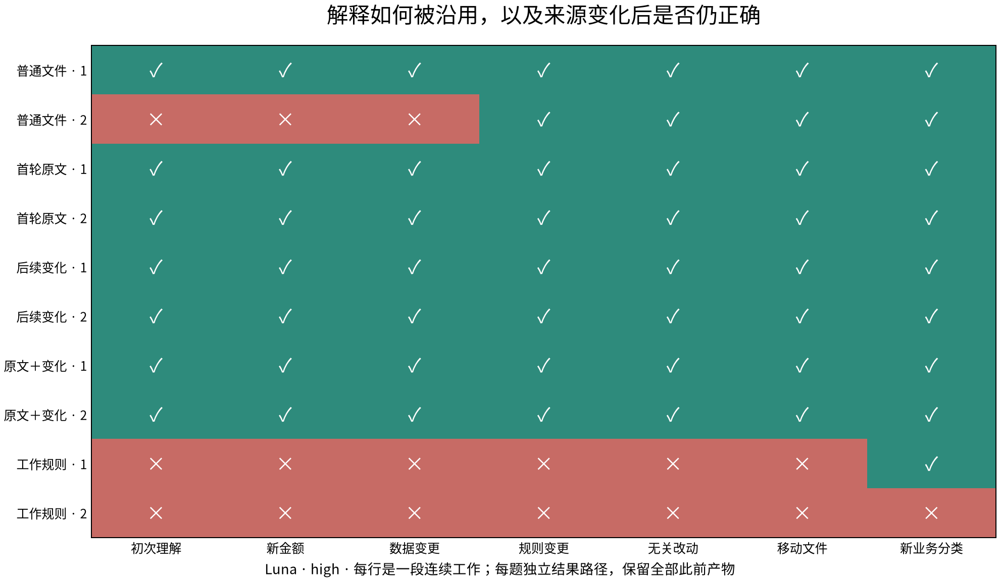
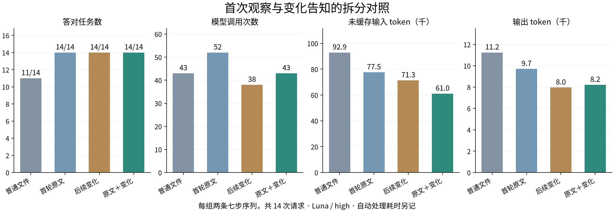
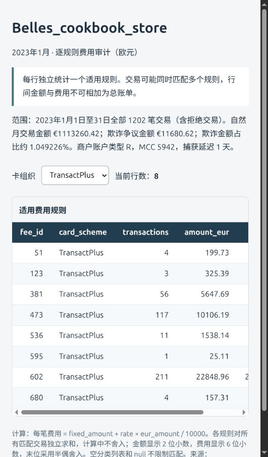

# 来源说明、工作接续与精确产物

本组研究把资料发现、解释形成、编程计算、来源变化和产物使用放在连续工作中检验。当前方案是：保留原生来源，把含义与逻辑范围关联到对应数据，按任务形成程序、查询或其他工作表示，按需要提供来源观察，直接交付程序产生的结果。

普通文件、脚本和成熟查询工具完成了复合分析的全部任务。来源观察在若干序列中减少了 token，也出现了调用次数不减少或未缓存输入增加的情况。它适合作为可配置的输入能力，不能据此要求所有工作通过新的统一访问 API。

## 资料、条件与计量

本报告的当前协议包含 **192 次任务请求**，涉及 Astra、Luna，均使用 high。另保留 **116 次诊断记录**。前一阶段的 117 次查询与组合实验见[独立报告](../2026-10-01/report.md)。

[DABstep](https://huggingface.co/datasets/adyen/DABstep) 固定在 `8afcb4ee3df0d73da5e0cddfddfb55665b760169`，包含七份原生材料：说明文档、CSV 和 JSON；交易记录为公开基准的合成数据。使用其 dev 问题和明确标识的受控变体，不提交官方榜单。Repa 材料为固定提交 `040aa16d7c7a142cdebf39388486c1bc65a98387` 的十七份原文。

所有条件允许相同的 shell、Python、Pandas、DuckDB、批量处理和任意编程。程序通过 Codex 原生循环运行，语料只读，工作目录可写。生成器和评分器位于隔离环境之外；没有额外模型替某一条件解释业务。

首次观察由原文分段、schema 推断和词法检索生成。变化观察比较来源版本，对正文已知且长度允许的文本提供 diff，大文件提供变化提示。自动处理耗时单独保留。每个任务的结果写入独立文件，之前的程序、笔记和结果继续可见；宿主读取该文件评分。

输入 token 包含缓存命中的输入，未缓存输入等于输入减去缓存输入。连续会话采用原生累计用量的差值，避免重复累加。表中模型调用次数来自完成事件；耗时是运行时 turn 的耗时，自动观察预处理另记。压缩调用的供应方 token 没有完整暴露，不把其零增量线程计数解释为零消耗。

## 首次解释与来源变化

七步工作依次处理：首次计算、新金额、费率数据改变、手册中的费率单位改变、无关文字改动、文件移动和新的业务分类。每次请求都告知来源可能已经更新。每个条件运行两条完整序列；同一序列中的七步共享前期工作，不作为七个独立样本解释。

| 条件 | 答对任务 | 完整正确序列 | 模型调用 | 输入 token | 缓存输入 | 未缓存输入 | 输出 token |
| --- | ---: | ---: | ---: | ---: | ---: | ---: | ---: |
| 普通文件 | 11/14 | 1/2 | 43 | 1,279,964 | 1,187,072 | 92,892 | 11,240 |
| 文件＋工作规则 | 1/14 | 0/2 | 59 | 1,814,965 | 1,692,160 | 122,805 | 18,522 |
| 首轮相关原文 | 14/14 | 2/2 | 52 | 1,276,645 | 1,199,104 | 77,541 | 9,701 |
| 后续来源变化 | 14/14 | 2/2 | 38 | 982,145 | 910,848 | 71,297 | 7,957 |
| 原文＋变化 | 14/14 | 2/2 | 43 | 1,038,167 | 977,152 | 61,015 | 8,206 |



普通文件的一条序列从错误的空列表解释开始，在读取更新后的规则时修正；另一条始终正确。工作规则条件要求保存计算方式与依据、复用前核对定义和变化，两条序列仍从错误解释开始并持续沿用。其问题发生在资料解释，不能由保存程序本身解决。

首次观察、变化告知和二者组合在这组各自得到 14/14。组合条件与普通文件的模型调用同为 43 次，未缓存输入从 92,892 降到 61,015，输出从 11,240 降到 8,206。该结果支持选择性提供观察；它不支持“必须同时启用两种机制”或“必然减少模型往返”。



## 改善来源本身的组织

local_contract 条件把同一段补充解释从手册末尾移到费用字段和空值说明旁，不添加事实、工具或自动观察。四条序列的首次解释全部正确。

持续会话的两条序列合计 10/14，一条在费率单位改变后继续使用旧公式。每题换新会话但保留全部文件的两条序列得到 14/14。字段说明的可见性和旧解释在变化后的适用性需要分别处理；原文位置改善不能自动更新已经形成的程序。

原始 DABstep 探针还暴露了题目和说明的歧义：1305 的空列表含义没有像 null 一样明确；1681 的日期措辞被解释成第十天或十月；70 的一份回答把更高处理费推成了已有罚款规则。新增 Catalog API 的三个运行都没有实际调用它。这六次探针用于发现问题，不用两组分数差声称 API 有效。

## 新会话与原生压缩

新会话条件每题都开始新的对话，同时保留同一工作目录中的全部程序与产物。

| 模型与条件 | 答对任务 | 模型调用 | 未缓存输入 | 输出 token |
| --- | ---: | ---: | ---: | ---: |
| gpt-6-astra · 普通文件 | 7/7 | 30 | 146,564 | 4,446 |
| gpt-6-astra · 原文＋变化 | 7/7 | 28 | 130,207 | 4,503 |
| gpt-6-luna · 普通文件 | 5/7 | 51 | 155,819 | 11,103 |
| gpt-6-luna · 原文＋变化 | 7/7 | 41 | 123,900 | 7,966 |

两条 Luna 原生压缩序列在第三步之后调用 `thread/compact/start`。普通文件得到 4/7，原文加变化得到 7/7；后者在压缩后重新提供当前相关原文。压缩生命周期、实际耗时与返回的线程计数单独保留。实验使用既有压缩能力，未另写摘要或历史管理器。

## 从计算方法接续到交互产物

复合序列要求按日和按月查费用规则、计算单项费率变更的影响、处理月度背景改变、在新会话查询另一商户、生成 CSV 审计和交互网页，再对变化后的费率生成新版本报告。

1 月 20 日增加一笔非欺诈交易后，1 月 10 日的交易行保持不变，但整月金额跨过一百万欧元。当天的正确费用集合应移除 454、加入 602。四组均正确处理这项非局部依赖，换会话后也继续完成工作。

| 模型与条件 | 答对任务 | 模型调用 | 未缓存输入 | 输出 token |
| --- | ---: | ---: | ---: | ---: |
| gpt-6-astra · 普通文件 | 7/7 | 28 | 79,122 | 7,570 |
| gpt-6-astra · 原文＋变化 | 7/7 | 23 | 95,448 | 5,371 |
| gpt-6-luna · 普通文件 | 7/7 | 33 | 69,570 | 15,423 |
| gpt-6-luna · 原文＋变化 | 7/7 | 30 | 55,312 | 11,938 |

普通文件和自动观察的四组都完成七步。Astra 加观察后调用次数减少，但未缓存输入从 79,122 增到 95,448；Luna 加观察后两项均减少。复用普通程序已经足以承载这项工作，额外观察的代价和收益取决于具体调用过程。

CSV 与网页内嵌 JSON 分别核对了逐规则的交易数、金额和费用。四份新版本网页的实际筛选都从 35 行正确变成 8 条 TransactPlus 规则，并显示更新后的规则 602 费用；旧版 CSV 与网页字节保持不变。[浏览器验证记录](browser-verification.json)保留具体观察。

[旧版报告](example-report/5.html)、[更新后的报告](example-report/6.html)和[对应 CSV](example-report/6.csv)给出可独立打开的示例。公开副本补充数据来源和实验标识；原始模型工件保留在归档中。



## 文件布局与中文材料

布局实验将同一千条当前费用记录放在一个文件、32 个分片，或 256 个分片加历史副本中。说明明确当前集合与历史集合的边界。普通文件在六次任务中答对五次，自动观察答对六次；唯一失败仍是空列表解释，没有观察到漏掉分片或混入历史记录。自动结构处理每题约 1.9—3.5 秒。这里改变了文件布局，没有增加有效记录数量。

中文 Repa 文档最初不能被现有词法分词命中，接入 jieba 后再比较。普通文件与自动观察均答对三题，摘录均能定位到原文。模型调用分别为 16 与 9，未缓存输入分别为 89,190 与 42,738。这组检验设计陈述和出处，不将文档中的目标设计当作产品已经实现。

## 形成的设计约定

- 来源说明与其解释的数据关联，交代字段、单位、空值、时间规则、集合边界和操作入口。机械推断的 schema 不替代这些含义。
- 工作表示按任务形成，使用现成程序、查询、表或文档。结果范围与计算依赖分别表达；按天输出不意味着只读取当天数据。
- 来源观察携带实际定位、修订和覆盖范围。截断、无匹配、未处理与不可读分别表达，保留原生访问。
- 来源变化供模型判断如何继续。数据变更经常只需重算；定义变化可能要求修改程序。变化不自动触发全部重建。
- 结果由程序值或文件直接交付，每次结果有自己的记录与版本。会话切换、压缩和工作目录保留分别接入既有运行时与内容能力。

[设计说明](../../docs/design.md)给出责任、组合方式和 Repa 接入边界。[已有系统](../../docs/related-systems.md)说明 DuckDB、LOTUS、DocETL、数据描述格式等复用位置。方案沿用原生正文与业务存储、原生查询语言和能力自有的数据模型。

## 协议修正与复现

早期接续协议清理同名 `answer.json`，会删除前次产物。它不能代表完整保留工作文件的基线；相关比较已经按每题独立路径重跑。此前“只有组合观察才保持正确”的判断撤回。116 次诊断记录保留并标记，不混入本报告当前协议的 192 次任务。另一次评分器未接受 EUR 前缀的错误包含在诊断记录中，其缺失用量不补造为零。

完整复现入口见[实验协议](../../docs/raw-source-experiments.md)。公开材料包括 [逐次记录](runs.jsonl)、[汇总](summary.json)、[来源和冻结实现](provenance.json)、[原始工作工件](artifacts.tar.gz)及其[校验信息](artifacts.json)。每个批次的实现哈希独立保留，旧归档不随主源码修改。

```bash
uv sync --locked --group environment --group analysis
uv run python -m agent_data_lab.fetch_data
uv run --group environment python -m agent_data_lab.episodes --output campaigns/reproduce --models gpt-6-luna --modes conversation --context none,discovery,changes,both,instructions --replicates 2
uv run --group environment python -m agent_data_lab.composed_work --output campaigns/reproduce-composed
```

新运行会调用模型，源码以所用版本为准。恢复本报告批次时按 provenance 中的归档哈希使用对应冻结实现。语料仅包含公开与合成材料；对外记录不包含凭据、私有配置或模型隐藏推理。
