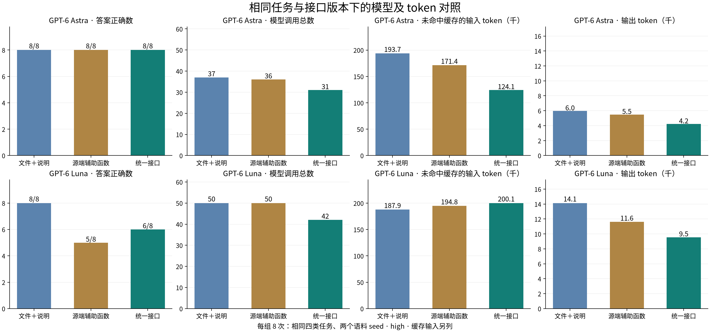
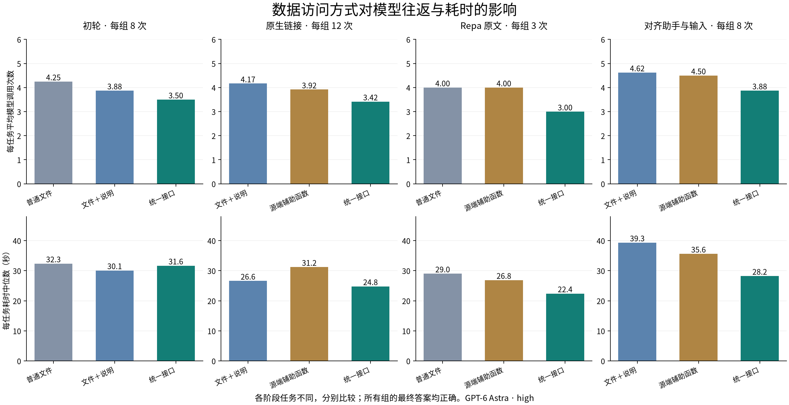

# Agent 数据访问实验结果

统一寻址、范围与引用查询减少了若干任务的模型往返，但较小模型没有在本批次因此获得更高正确率。实验还暴露了一个独立环节：程序已经计算正确，模型重新转录成最终答案时仍会添错或漏项。读取、程序组合和结果交付需要分别设计。

本轮完成 117 次正式模型任务运行，另有 3 次运行入口校验。实验使用 GPT-6 Astra 与 GPT-6 Luna，均为 high 思考强度，通过 Codex 0.159.2 的原生循环执行。所有条件允许 bash、rg、Python、批量读取和自主编程；没有要求普通文件组逐条读取。生成器和标准答案不进入模型工作区。

## 相同任务下的模型与 token 对照

下表只比较最终对齐条件：相同四类任务、两个语料 seed，每组八次运行。Astra 与 Luna 使用的语料、访问实现、运行器和工具说明哈希完全一致，仅模型不同。

| 模型 | 条件 | 正确结果 | 模型调用 | 输入 token | 其中缓存输入 | 未缓存输入 | 输出 token |
| --- | --- | ---: | ---: | ---: | ---: | ---: | ---: |
| Astra | 文件＋说明 | 8/8 | 37 | 871,031 | 677,376 | 193,655 | 5,959 |
| Astra | 源端辅助函数 | 8/8 | 36 | 790,202 | 618,752 | 171,450 | 5,490 |
| Astra | 统一接口可用 | 8/8 | 31 | 588,711 | 464,640 | 124,071 | 4,244 |
| Luna | 文件＋说明 | 8/8 | 50 | 1,037,328 | 849,408 | 187,920 | 14,131 |
| Luna | 源端辅助函数 | 5/8 | 50 | 991,171 | 796,416 | 194,755 | 11,604 |
| Luna | 统一接口可用 | 6/8 | 42 | 906,432 | 706,304 | 200,128 | 9,531 |



输入按每次模型调用累计，包含重复传入的前缀和上下文；缓存输入是输入总量的一部分。未缓存输入等于两者之差。以上均取自服务的实际使用量报告，不由字符或交付字节估算。

对于 Astra，接口组相对完整辅助函数组，模型调用减少 13.9%，未缓存输入减少 27.6%，输出减少 22.7%，正确结果保持八次。对于 Luna，对应调用减少 16.0%、输出减少 17.9%，未缓存输入反而增加 2.8%；文件加说明组的正确结果最多。因此不能仅依据较少调用或较少总输入认定接口组全面更优。

接口和助手均按需使用，没有强制模型调用。这里比较的是可用环境和模型自行选择后的完整任务结果。失败轨迹不会因未使用所提供接口而被移出所在组。

## 逐步补齐对照

| 阶段 | 每组运行数 | 条件 | 正确结果 | 模型调用总数 | 每任务耗时中位数 |
| --- | ---: | --- | ---: | ---: | ---: |
| 初轮 | 8 | 普通文件 | 8/8 | 34 | 32.3 秒 |
| 初轮 | 8 | 文件＋数据说明 | 8/8 | 31 | 30.1 秒 |
| 初轮 | 8 | 统一接口 | 8/8 | 28 | 31.6 秒 |
| 原生链接与助手对照 | 12 | 文件＋数据说明 | 12/12 | 50 | 26.6 秒 |
| 原生链接与助手对照 | 12 | 源端解析助手 | 12/12 | 47 | 31.2 秒 |
| 原生链接与助手对照 | 12 | 统一接口 | 12/12 | 41 | 24.8 秒 |
| 未改写的 Repa 文档 | 3 | 普通文件 | 3/3 | 12 | 29.0 秒 |
| 未改写的 Repa 文档 | 3 | 源端解析助手 | 3/3 | 12 | 26.8 秒 |
| 未改写的 Repa 文档 | 3 | 统一接口 | 3/3 | 9 | 22.4 秒 |
| 对齐助手与输入，Astra | 8 | 文件＋数据说明 | 8/8 | 37 | 39.3 秒 |
| 对齐助手与输入，Astra | 8 | 完整源端助手 | 8/8 | 36 | 35.6 秒 |
| 对齐助手与输入，Astra | 8 | 统一接口 | 8/8 | 31 | 28.2 秒 |
| 同版本较小模型，Luna | 8 | 文件＋数据说明 | 8/8 | 50 | 50.1 秒 |
| 同版本较小模型，Luna | 8 | 完整源端助手 | 5/8 | 50 | 45.7 秒 |
| 同版本较小模型，Luna | 8 | 统一接口 | 6/8 | 42 | 33.5 秒 |



同一阶段的题目、底层事实、模型和思考强度一致，条件顺序随机化，至多并行三个独立任务。阶段间任务与输入表示不同，分别比较。第二阶段为六类任务、两个语料 seed；最终模型对照为四类任务、两个 seed。模型调用包括初次推理、工具返回后的继续推理和最终作答，由真实完成事件计数。

初轮区分文件、数据说明和接口。接口组相对普通文件组，八次配对中四次减少调用、三次相同、一次增加调用。

初轮接口同时提供解析实现和统一访问行为。第二阶段增加直接提供解析函数的对照，与接口共用底层实现，并加入相对链接、内嵌 HTML、未分类文字资料、损坏和缺失文件。接口相对解析助手，在十二次配对中七次减少调用、三次相同、两次增加调用。

随后补齐了助手组的 SQLite 连接和 JSONL 读取，使其与接口组共用相同实现。引用范围也改为程序直接读取的 JSON 输入，其中只包含部分文档，范围外保留真实链接作为干扰。该阶段先测 Astra，再以完整源码快照测 Luna；发现错误后保持实现与评分不变，在另一组语料上同时补测两种模型。

范围文件和助手对齐同时发生，因此不把跨阶段耗时差归因于某一个变化。模型间的延迟也保留为本次运行数据；主要判断来自同模型内配对的结果和实际过程。

## 失败发生在哪里

Luna 的五次错误全部保留在正式统计中：

| 运行 | 观察到的错误 | 发生环节 |
| --- | --- | --- |
| seed 2027，助手，decision | 返回 e049，正确合格最优项为 e113 | 输出全表后选择，没有完成带条件的最优查询 |
| seed 4099，接口，decision | 返回 e001，正确项为 e089；后续只核对选中项的条件 | 没有检查全体合格项中的最优结果 |
| seed 2027，助手，references | 程序返回 @12:1、@14:1、@14:2，最终答案额外增加 @12:2 | 结果重新转录 |
| seed 4099，助手，references | 程序返回正确的 24 项，最终答案改错两个位置并遗漏一项来源 | 结果重新转录 |
| seed 2027，接口，join | 程序输出正确匹配集合，最终 answers 额外加入一个明确标注“不含短语”的对象 | 结果重新转录与集合语义 |

两个接口组失败均没有调用 Space：模型读过接口说明，随后自行使用文件与 SQLite。不能把接口可用等同于已经采用接口，也不能从正确的底层查询推断最终答案必然正确。

对后三条轨迹另做了确定性重放：仅转换已经观察到的程序输出，再由原评分器评分；三条均正确。[重放结果](result-transfer-replay.json)保留转换后的值与原始评分。它不计作新模型运行，也不修改原模型失败记录。这将问题定位到结果交付，而不是链接解析或数据缺失。

这些错误按精确机器输出要求评分。错误选择、凭空增加的引用位置、漏项，以及把非匹配对象放进 answers 均不满足任务；报告同时给出具体偏差，避免把性质不同的失败藏在总正确率中。

## 对设计的影响

**范围和地址组合减少了重复工作。** Astra 的跨来源连接通常需要先从练习记录选对象，再查正文条件，再取得目标内容。统一引用和范围使这些操作留在同一个程序中完成，减少了检查来源形状和重写拼接的步骤。真实 Repa 文档的三项关系任务也各减少一次模型调用。

**原生查询仍需保留。** 单纯 SQL 选择没有持续获得同样收益。额外包装和说明既不保证被使用，也不保证形成正确的选择程序。插件提供业务已确定的状态、单位和关系语义，原生查询及现有辅助函数继续使用。

**查询不完整时，应保留接续入口。** 混合来源任务中，接口能保留缺失、损坏和尚不支持的对象。模型继续读取未分类文字资料，并把真正无法判断的对象留为未决。各组都完成了这个任务，接口的作用是集中处理重复的范围和失败语义。

**程序输入和程序结果都不应依赖重新抄写。** 第二阶段有接口组轨迹把题目中的一百二十个引用重新生成进代码，增加输出与等待。普通 JSON 输入文件即可让程序复用范围。较小模型又暴露了相反方向的转录错误：已算出的结果重新进入语言生成后发生变化。精确清单应作为结构化结果或普通文件直接交付，模型解释另行呈现。

**完整性必须绑定查询域。** 原型默认遍历 inventory.json，不能据此声称覆盖全部 SQLite 业务关系。产品查询应先声明数据范围，再查找适用提供器；某个已知来源没有相应能力时，保留未覆盖状态，不能因其未注册查询实现而消失。

保留已有文件正文、ContentRef、修订与业务数据库。把范围、引用位置和覆盖约定接入材料检索、内容整理等能力，允许普通代码组合；写入仍回到已有内容操作和业务操作。此次结果不要求新的数据库引擎、全局业务 schema、通用查询语言或强制中央关系库。具体取舍见[当前设计](../../docs/design.md)。

## 原型健壮性

确定性检查发现，最初仅识别专用 repa 地址和 CommonMark link token 的实现，会漏掉相对路径和 Markdown 中的 HTML 链接，却仍返回完整覆盖。后续版本补齐了解析；第一轮仍保留其启动时冻结的代码，没有用修复覆盖旧实验。

另行核对了重复引用、代码伪链接、空与重复范围、范围先于截断、零上限时的匹配总数、移动后的身份、过期修订、未知对象、损坏来源和含糊身份。检查全部通过。模型程序的文件系统不包含宿主配置、生成器或标准答案；记录器丢弃隐藏推理事件，只保留可见交互和使用量。当前运行器在每次工具结束后立即保留该次轨迹，后续异常不会抹掉已完成观察。

任务集以可判定的数据读取与组合为主，并补充了真实 Repa 文档任务。本报告不把这些访问行为的结果扩成开放学习过程的质量结论。

## 证据与复现

- [逐次可见轨迹、最终回答和评分](runs.jsonl)：117 次正式运行，包括五次错误，不含入口校验。
- [分组指标与逐题配对差值](summary.json)：图表及正文数字由此生成。
- [语料、任务、运行顺序与实现哈希](provenance.json)：最终两模型对照的实现哈希均为 `720df03749fef94c4a73191c51698e249840270fcfb4799bbade0da4c582c191`，同 seed 的语料哈希一致。
- [冻结实现归档](implementations)：保存各阶段实际使用的完整 Python 包，含工作区尚未提交时的源码；provenance 同时记录归档路径与校验值。
- [结果交付重放](result-transfer-replay.json)、[实验协议](../../docs/experiment.md)、[源码](../../src/agent_data_lab)、[行为检查](../../tests)。

复现某阶段时，使用 provenance 对应的冻结实现归档并核对哈希；仅在最新代码上使用相同阶段名称不等于恢复旧实验。代码、语料与评分可恢复，模型可能产生不同轨迹。当前完整助手对照的运行入口如下，campaign 会实际调用模型：

```bash
uv sync --locked
uv run python -m unittest discover -s tests -q
uv run data-lab campaign --output campaigns/new-comparison --version comparison \
  --seed 2027 --variant native --scope-file --model gpt-6-luna --effort high \
  --conditions described,helpers,interface --tasks join,references,mixed,decision
```

对保留的实验目录重新汇总和绘图：

```bash
uv sync --locked --group analysis
uv run --group analysis python -m agent_data_lab.analyze --plot
uv run python -m agent_data_lab.diagnostics
```

模型循环与事件通道复用 [Codex app-server](https://learn.chatgpt.com/docs/app-server)，Markdown 语法复用 [markdown-it-py 的 CommonMark 解析](https://markdown-it-py.readthedocs.io/en/latest/using.html)。未改写的真实资料来自 [Repa 固定提交](https://github.com/Utopia-V/repa/tree/040aa16d7c7a142cdebf39388486c1bc65a98387)。
